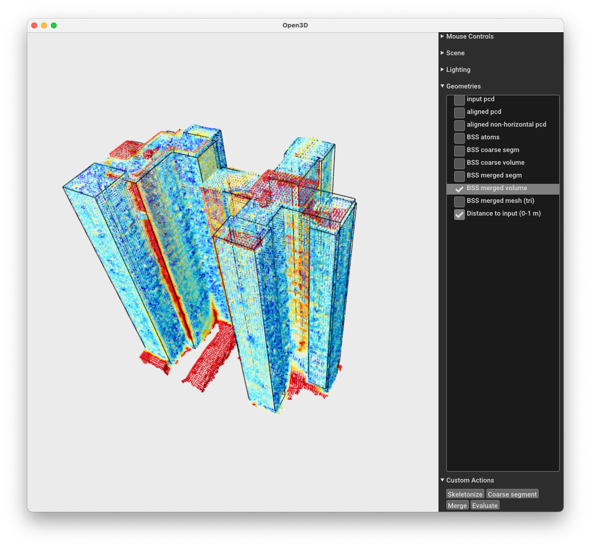

# About sobss

Compact building reconstruction based on Single-orientation Building Section Skeleton (BSS). This is an implementation of the [paper](https://doi.org/10.1016/j.isprsjprs.2024.01.020): 

```
Yijie Wu, Fan Xue*, Maosu Li, and Sou-Han Chen, 2024.
A novel Building Section Skeleton for compact 3D reconstruction from point clouds: A study of high-density urban scenes.
ISPRS Journal of Photogrammetry and Remote Sensing 209, 85-100. 
```

# How to use
## Dependencies
- [open3d](https://www.open3d.org/)
- [cgal](https://www.cgal.org/)
- [nlopt](https://nlopt.readthedocs.io/)
- [eigen](https://eigen.tuxfamily.org/)
- [xtensor](https://github.com/xtensor-stack/xtensor)
- [gurobi](https://www.gurobi.com/)
- [openmp](https://www.openmp.org/)
- [rapidjson](https://rapidjson.org/)
## Build from source
```
git clone https://github.com/eiiijiiiy/sobss.git
cd sobss
mkdir build
cd build
cmake ..
make
```
## Run the gui
### Video instruction
[](http://www.youtube.com/watch?v=AKNAsfuQb94)
### Text instruction
- Set the path to the input point cloud, a directory to save the intermediates and final results, and parameters (optional). 
```
cd ../
python main.py \
-i <path to the input point cloud *.ply [required]> \
-w <directory of the working folder (will be cleared before running) [required]> \
-v <voxel size in `skeletonizing` [optional]> \
-p <distance interval to group BSS atoms in `coarse segmentation` [optional]> \
-n <angular interval to group BSS atoms in `coarse segmentation` [optional]> \
-s <truncated distance in `merging` [optional]> \
-l <factor weighting the compactness and accuracy in `merging` [optional]> 
```
- Click the buttons `skeletonize`->`coarse segment`-> `merge`->`evaluate`. Results will be shown in the open3d window.

## OS tested on
- Ubuntu 20.04 LTS
- MacOS 14.1.1 M1

# Test data and results
Data and results can be downloaded at [OneDrive](https://connecthkuhk-my.sharepoint.com/:f:/g/personal/yijiewu_connect_hku_hk/Ej77MEfWVCtLrJVM-27fO40Brt0B5MLBiAErMaX3p0M3YQ?e=2cHrAg): 
- Inputs: 15 scenes tested in the paper can be found in `0-input`. 
- Results: Reconstructed results are in `2-union_tri(results)`. 
- Evaluation: Inputs colorized in terms of the distances to the results are in `3-r2s(evaluation)`.

# Contacts

- Wu, Y.: [yijiewu@connect.hku.hk](mailto:yijiewu@connect.hku.hk?subject=[GitHub]sobss)
- Xue, F.: [xuef@hku.hk](mailto:xuef@hku.hk?subject=[GitHub]sobss), [frankxue.com](https://frankxue.com/)
